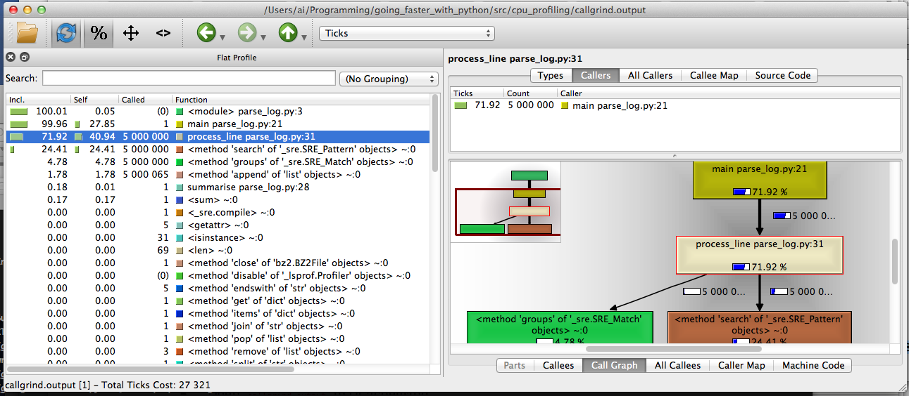

## Contents

-   What, why
-   Time - where, how often
-   Memory - how much, of what type
-   Web frameworks
-   Extra slides

--- .contents_section_1

## Contents

-   What, why
-   Time - where, how often
-   Memory - how much, of what type
-   Web frameworks
-   Extra slides

---

## What, why

-   Want to know *what* a programme is doing
    -   Debugging
    -   Optimisation
-   **Deterministic** vs. **statistical** profiling

---

## Our code example - log parsing

-   Input: bzip-compressed log file.
    -   Format: `epoch,metric,value`

            1362331306,cpu_usage,74
            1362331307,memory_usage,1396
            1362331308,cpu_usage,13
            ...

-   Output: arithmetic mean of CPU usage.
    -   Metric = `cpu_usage`

---

## Code caveat

-   This purpose of this presentation **is not** "how do I parse this log file the fastest?".
    -   The code that follows is **deliberately obtuse and non-idiomatic**.

---

```python
re_log_line = re.compile("(.*?),(.*?),(.*)\n")

def main():
    cpu_usages = []
    with contextlib.closing(bz2.BZ2File(log_filepath)) as f_in:
        for line in f_in:
            process_line(line, cpu_usages)
    summarise(cpu_usages)

def summarise(cpu_usages):
    print "avg: %s" % (sum(cpu_usages) / len(cpu_usages), )

def process_line(line, cpu_usages):
    re_obj = re_log_line.search(line)
    try:
        elems = re_obj.groups()
    except:
        pass
    else:
        if elems[1] == "cpu_usage":
            cpu_usages.append(int(elems[2]))
```

--- .contents_section_2

## Contents

-   What, why
-   Time - where, how often
-   Memory - how much, of what type
-   Web frameworks
-   Extra slides

---

##  Time

-   `cProfile` is a great built-in deterministic profiler.
    -   **deterministic** $\Rightarrow$ comprehensive; observer effect!
-   `kcachegrind` is the most user-friendly way to explore call graphs.
-   `line_profiler` has even higher overhead, but allows you line-by-line insight.

---

## `cProfile` from CLI

```
python -m cProfile -o profile.stats parse_log.py
```

-   Outputs `profile.stats` to current directory.
-   Can get a list of "hot functions" quite easily:

```
python -c "import pstats; p = pstats.Stats('profile.stats'); p.sort_stats('time').print_stats(5)"

   ncalls  tottime  percall  cumtime  percall filename:lineno(function)
  5000000   12.930    0.000   23.044    0.000 cpu_profiling/parse_log.py:31(process_line)
        1    8.666    8.666   31.756   31.756 cpu_profiling/parse_log.py:21(main)
  5000000    7.917    0.000    7.917    0.000 {method 'search' of '_sre.SRE_Pattern' objects}
  5000000    1.621    0.000    1.621    0.000 {method 'groups' of '_sre.SRE_Match' objects}
  5000065    0.575    0.000    0.575    0.000 {method 'append' of 'list' objects}
```

---

```
   ncalls  tottime  percall  cumtime  percall filename:lineno(function)
  5000000   12.930    0.000   23.044    0.000 cpu_profiling/parse_log.py:31(process_line)
        1    8.666    8.666   31.756   31.756 cpu_profiling/parse_log.py:21(main)
  5000000    7.917    0.000    7.917    0.000 {method 'search' of '_sre.SRE_Pattern' objects}
  5000000    1.621    0.000    1.621    0.000 {method 'groups' of '_sre.SRE_Match' objects}
  5000065    0.575    0.000    0.575    0.000 {method 'append' of 'list' objects}
```

-   Program took 31.756s to run.
-   **`tottime`**: total time spent in function *excluding* calls to subfunctions.
-   **`cumtime`**: total time spent in function *including* calls to subfunctions.
-   Note the obvious for `main`, that `cumtime = percall` and `ncalls = 1`.
-   Top three functions take $\frac{12.930+8.666+7.917}{31.756} \times 100 = 92.9\%$ of time.

---

```
   ncalls  tottime  percall  cumtime  percall filename:lineno(function)
  5000000   12.930    0.000   23.044    0.000 cpu_profiling/parse_log.py:31(process_line)
  5000000    7.917    0.000    7.917    0.000 {method 'search' of '_sre.SRE_Pattern' objects}
  5000000    1.621    0.000    1.621    0.000 {method 'groups' of '_sre.SRE_Match' objects}
  5000065    0.575    0.000    0.575    0.000 {method 'append' of 'list' objects}

def process_line(line, cpu_usages):
    re_obj = re_log_line.search(line)
    try:
        elems = re_obj.groups()
    except:
        pass
    else:
        if elems[1] == "cpu_usage":
            cpu_usages.append(int(elems[2]))
```

-   `process_line` takes $\frac{12.930}{31.756} \times 100 = 40.7\%$ of the time **excluding** calls to subfunctions.

---

```
   ncalls  tottime  percall  cumtime  percall filename:lineno(function)
        1    8.666    8.666   31.756   31.756 cpu_profiling/parse_log.py:21(main)

def main():
    cpu_usages = []
    with contextlib.closing(bz2.BZ2File(log_filepath)) as f_in:
        for line in f_in:
            process_line(line, cpu_usages)
    summarise(cpu_usages)
```

-   `main` takes $\frac{8.666}{31.756} \times 100 = 27.3\%$ of time, **excluding** calls to subfunctions.

---

## `kcachegrind`

-   Download KCachegrind source, build QT GUI called `QCachegrind`.
-   Generate a `cProfile` output file, as before.
-   `pip install pyprof2calltree`
-   `pyprof2calltree -i profile.stats -o callgrind.output`
-   Open `callgrind.output` in `QCachegrind`

--- &vcenter



--- 

## `line_profiler`

```python
(going_faster_with_python)Mill:src ai$ kernprof.py -l -v cpu_profiling/parse_log_line_profiler.py

File: cpu_profiling/parse_log_line_profiler.py
Function: main at line 21
Total time: 105.217 s

Line #      Hits         Time  Per Hit   % Time  Line Contents
==============================================================
    21                                           @profile
    22                                           def main():
    23         1            2      2.0      0.0      cpu_usages = []
    24         1           34     34.0      0.0      with contextlib.closing(bz2.BZ2File(log_filepath)) as f_in:
    25   5000001     11602598      2.3     11.0          for line in f_in:
    26   5000000     93565103     18.7     88.9              process_line(line, cpu_usages)
    27         1        49088  49088.0      0.0      summarise(cpu_usages)
```

-   Nothing surprising.   

---

```python
File: cpu_profiling/parse_log_line_profiler.py
Function: process_line at line 32
Total time: 44.2081 s

Line #      Hits         Time  Per Hit   % Time  Line Contents
==============================================================
    32                                           @profile
    33                                           def process_line(line, cpu_usages):
    34   5000000     14758591      3.0     33.4      re_obj = re_log_line.search(line)
    35   5000000      4406648      0.9     10.0      try:
    36   5000000      6765236      1.4     15.3          elems = re_obj.groups()
    37                                               except:
    38                                                   pass
    39                                               else:
    40   5000000      5814440      1.2     13.2          if elems[1] == "cpu_usage":
    41   5000000     12463137      2.5     28.2              cpu_usages.append(int(elems[2]))
```

-   `try` takes up time, and line 41 is opaque

--- .contents_section_3

## Contents

-   What, why
-   Time - where, how often
-   Memory - how much, of what type
-   Web frameworks
-   Extra slides

---

##  Memory

-   `pympler`, useful collection of modules
-   `memory_profiler` just like `line_profiler`

--- .contents_section_4

```python
import collections
from pympler import tracker

Point = collections.namedtuple("Point", ["x", "y"])
Line = collections.namedtuple("Line", ["line_number", "text"])

def get_point(i):
    return Point(i, i)

def get_line(i):
    return Line(i, "some random text" * 100)

def main():
    points = [get_point(i) for i in xrange(100000)]
    lines = [get_line(i) for i in xrange(10000)]

if __name__ == "__main__":
    main()
```

---

## `pympler.tracker`

-   Using `pympler.tracker.SummaryTracker()` is simplest.
-   Instantiate, run code, then call `print_diff()`.

```python
from pympler import tracker

def main():
    tr = tracker.SummaryTracker()
    points = [get_point(i) for i in xrange(100000)]
    lines = [get_line(i) for i in xrange(10000)]
    tr.print_diff()
```

---

## `pympler.tracker`

```
$ 03_memory/01_tracker_example.py 
                   types |   # objects |   total size
======================== | =========== | ============
                     str |       10968 |     15.66 MB
  <class '__main__.Point |      100000 |      6.87 MB
                     int |      109724 |      2.51 MB
                    list |         970 |    989.20 KB
   <class '__main__.Line |       10000 |    703.12 KB
                    dict |           1 |      1.02 KB
```

---

## `pympler.class_tracker`

-   Can filter by classes with another `pympler` module.
-   Note that it needs to use `weakref`'s, so can't track `namedtuples`
    -   Something to do with using `__slots__`? I'm not sure.
-   Change our example to use classes rather than named tuples

---

```python
class Point(object):
    def __init__(self, x, y):
        self.x = x
        self.y = y

class Line(object):
    def __init__(self, line_number, text):
        self.line_number = line_number
        self.text = text

def main():
    tracker = ClassTracker()
    tracker.track_class(Point)
    tracker.track_class(Line)
    tracker.create_snapshot()

    points = [get_point(i) for i in xrange(100000)]
    lines = [get_line(i) for i in xrange(10000)]

    tracker.create_snapshot()
    tracker.stats.print_summary()
```

---

```
$ 03_memory/03_class_tracker.py 
---- SUMMARY ------------------------------------------------------------------
                                         active      0     B      average   pct
  __main__.Line                               0      0     B      0     B    0%
  __main__.Point                              0      0     B      0     B    0%
                                         active      0     B      average   pct
  __main__.Line                           10000     19.14 MB      1.96 KB    0%
  __main__.Point                         100000     35.10 MB    368     B    1%
-------------------------------------------------------------------------------
```

---

## `memory_profiler`

-   Decorate functions with `@profile`, then run with `memory_profiler` module.
    -   Just like `line_profiler`.

---

```
$ python -m memory_profiler 03_memory/04_memory_profiler.py 
Filename: 03_memory/04_memory_profiler.py

Line #    Mem usage    Increment   Line Contents
================================================
    14                             @profile
    15     8.434 MB     0.000 MB   def main():
    16    30.953 MB    22.520 MB       lines = [get_line(i) for i in xrange(10000)]
    17    42.812 MB    11.859 MB       points = [get_point(i) for i in xrange(100000)]
```

--- .contents_section_5

## Contents

-   What, why
-   Time - where, how often
-   Memory - how much, of what type
-   Web frameworks
-   Extra slides

--- &vcenter .large

Thank you!  

